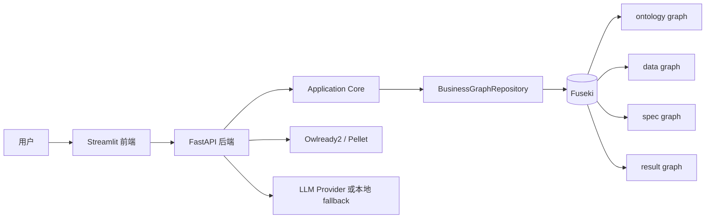
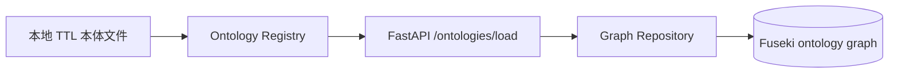
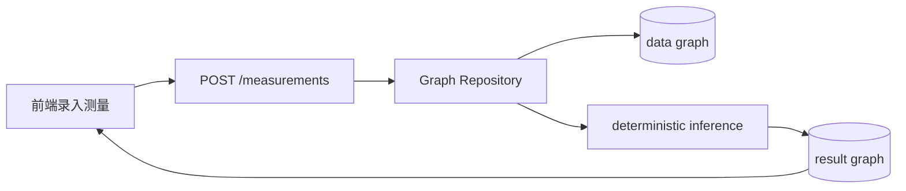
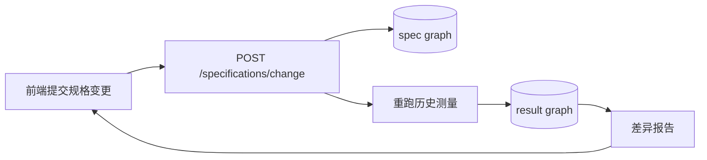
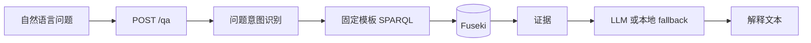
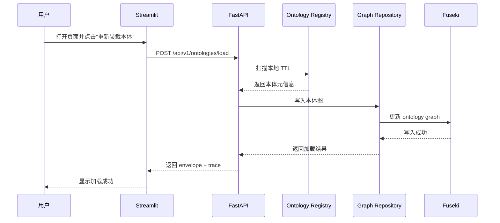
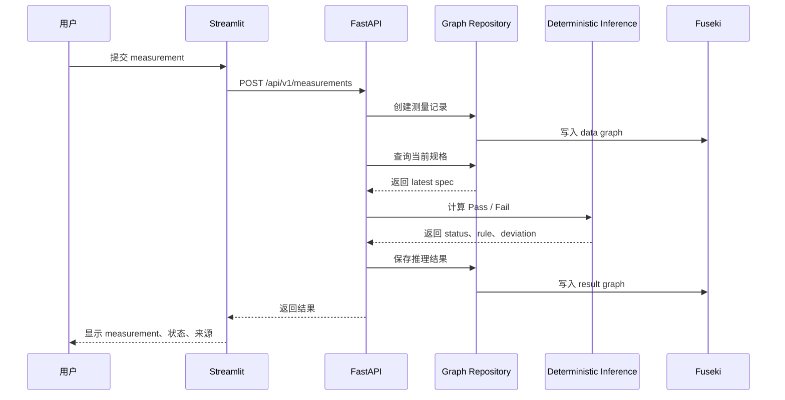
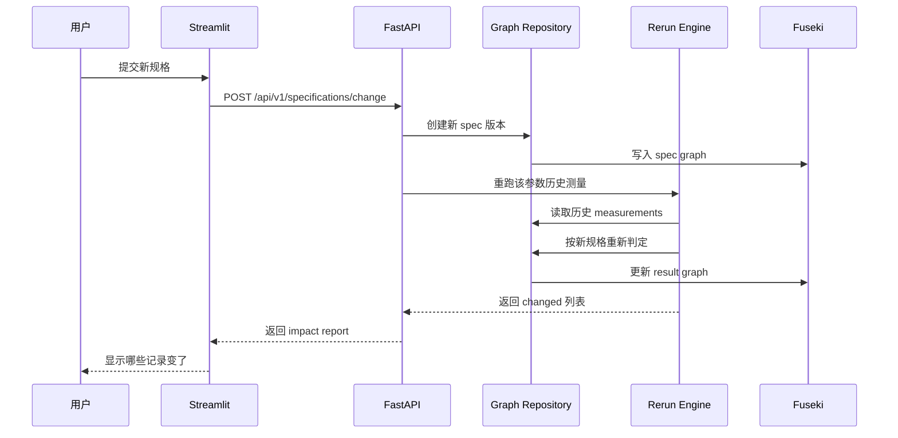
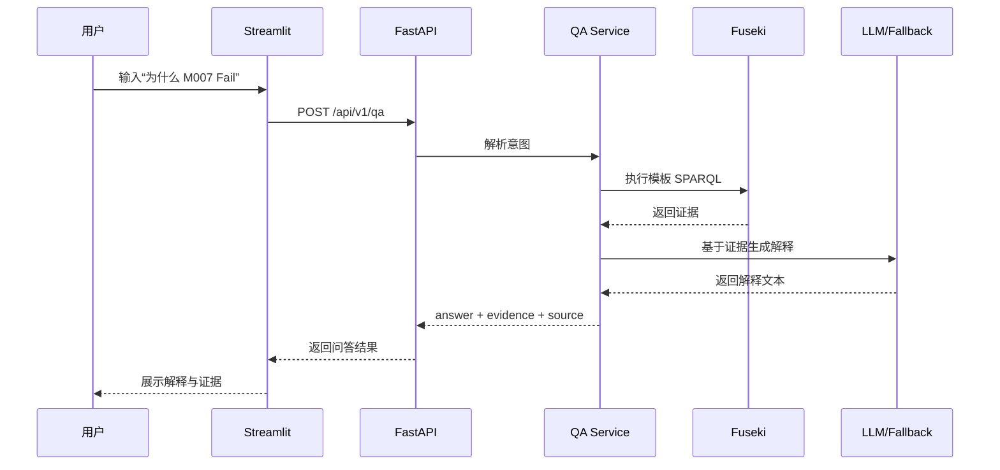

# 项目傻瓜式操作手册

适用对象：
- 你不懂本体论。
- 你想把这个项目跑起来、点起来、看懂它在干什么。
- 你希望知道每一步为什么要做，而不是只会复制命令。

本文目标：
- 用大白话解释什么是“本体”。
- 讲清楚这个项目到底解决什么问题。
- 讲清楚项目架构、数据流、时序图。
- 提供一套可以直接照着操作的步骤。
- 让你知道每一步成功时应该看到什么。

## 1. 先用一句话说清楚

### 1.1 什么是本体

在这个项目里，你可以先把“本体”理解成：

**一套全项目统一使用的业务说明书。**

这套说明书不只是词汇表，还包含：
- 业务里有哪些对象。
- 这些对象之间是什么关系。
- 每个对象有哪些属性。
- 有哪些约束和规则。
- 系统能基于这些规则做什么判断。

如果你还是觉得抽象，可以把它理解成三样东西的组合：

| 你熟悉的东西 | 在本体里相当于什么 |
| --- | --- |
| 数据字典 | 统一名词，避免每个人叫法不同 |
| 关系图 | 说明“谁和谁有关” |
| 规则底座 | 说明什么情况下算正常，什么情况下算异常 |

### 1.2 这个项目在做什么

这个项目是一个“制造业试验数据管理本体 MVP”。

它做的事情很具体：

1. 把制造试验里的对象和关系用本体表达出来。
2. 把真实试验数据存进图数据库 Fuseki。
3. 根据规格上下限判断一条测量值是 `Pass`、`Fail_Low` 还是 `Fail_High`。
4. 当规格变更时，自动重跑历史测量，告诉你哪些结果变了。
5. 允许你运行时注册新参数，而不是每次改数据库表结构。
6. 允许你用自然语言提问，比如“`M007` 为什么 Fail？”

### 1.3 你可以先不懂 OWL、RDF、SWRL

你完全可以先把这个项目当成一个带“业务字典”和“规则解释能力”的试验数据系统。

你当前真正需要知道的只有三件事：

1. 本体负责定义“这个业务世界里有什么”。
2. 数据负责记录“这个世界里真实发生了什么”。
3. 推理负责判断“这些真实数据意味着什么”。

## 2. 用大白话理解本体

### 2.1 本体不是哲学课

这里的“本体”不是讨论“人为什么存在”的哲学问题。

这里的本体，是软件系统里的“业务语义骨架”。

如果没有这层骨架，经常会出现这些问题：

- 同一个概念，不同系统叫不同名字。
- 一个字段到底是什么意思，没有统一口径。
- 规则写在很多地方，越写越乱。
- LLM 能生成回答，但不能保证和真实业务规则一致。
- 业务人员、开发人员、AI 助手看到的是同一份数据，却理解成不同的意思。

### 2.2 本体里常见的几个词

| 术语 | 大白话解释 | 本项目里的例子 |
| --- | --- | --- |
| 类 / 概念 | 一类东西 | `Trial`、`Batch`、`Measurement`、`Specification` |
| 个体 / 实例 | 具体的一条对象 | `T001`、`B03`、`M007`、`Spec_v1` |
| 关系 | 对象和对象之间怎么连起来 | `Measurement` 属于哪个 `Batch` |
| 属性 | 对象自己的字段 | 温度值、规格上限、操作人 |
| 约束 / 规则 | 哪些情况才合理 | 温度必须落在规格上下限范围内 |
| 推理 | 系统根据规则得出结论 | `197.2` 高于上限，所以 `Fail_High` |

### 2.3 什么是 TBox 和 ABox

这是本体里最容易把人绕晕的一对词，但其实很好理解。

| 名称 | 大白话 | 本项目里是什么 |
| --- | --- | --- |
| TBox | 规则框架，定义“世界长什么样” | `Trial`、`Measurement` 是什么；它们怎么关联 |
| ABox | 真实数据，定义“世界里发生了什么” | `T001`、`M007=197.2`、`Spec_v2 upper=190` |

你可以记成：

- **TBox = 模板和定义**
- **ABox = 真实记录**

## 3. 这个项目到底解决什么业务问题

这个项目想解决的不是“怎么做一个很炫的本体系统”，而是下面这些非常具体的问题：

### 3.1 问题一：测量结果怎么判断

比如有一个工艺参数叫“温度”，规格范围是 `180 ~ 195`。

如果测到：
- `179.5`，那就是偏低。
- `188.0`，那就是合格。
- `197.2`，那就是偏高。

### 3.2 问题二：规格改了以后，历史数据怎么办

比如一开始规格是：
- `Spec_v1`: `180 ~ 195`

后来收紧成：
- `Spec_v2`: `180 ~ 190`

这时就要知道：
- 历史数据里哪些原来是 `Pass`，现在变成 `Fail_High` 了。
- 这些变化是因为哪一次规格变更造成的。

### 3.3 问题三：新参数能不能不改表结构直接上

很多系统每新增一个参数，都要改表、改接口、改前端。

这个项目的思路是：
- 参数也是业务语义的一部分。
- 可以运行时注册新参数。
- 不要求你每次都改数据库表结构再发版。

### 3.4 问题四：结果能不能解释给人听

仅仅给一个 `Fail_High` 不够。

业务更关心：
- 为什么 Fail？
- 用的是哪个规格版本？
- 是哪条规则触发的？
- 这是不是最新结果？

这个项目会把推理链和证据保存下来，再交给 LLM 或本地 fallback 生成解释文本。

## 4. 用一条完整故事看懂整个项目

项目自带一套稳定的演示数据，方便你手动测试。

| 对象 | 演示数据 |
| --- | --- |
| Trial | `T001` |
| Batch | `B01`、`B02`、`B03` |
| Parameter | `temperature` |
| 初始规格 | `Spec_v1`，范围 `180 ~ 195` |
| 收紧后规格 | `Spec_v2`，范围 `180 ~ 190` |
| 测量值 | `M001 ~ M007` |

其中最关键的一条是：

| 测量 | 值 | 在 `Spec_v1` 下的结论 |
| --- | --- | --- |
| `M007` | `197.2` | `Fail_High` |

所以后面手测时，你可以直接用：

**`M007 为什么 Fail？`**

这是一条最容易走通的演示问题。

## 5. 架构总览

### 5.1 一张图先看懂



### 5.2 每个组件负责什么

| 组件 | 作用 | 你可以把它理解成什么 |
| --- | --- | --- |
| Streamlit 前端 | 提供页面操作入口 | 演示控制台 |
| FastAPI 后端 | 对外提供 API | 前后端之间的交通枢纽 |
| Core | 组织业务逻辑 | 项目的“脑子” |
| BusinessGraphRepository | 读写图数据 | 图数据总管 |
| Fuseki | 存放本体、数据、规格、结果 | 图数据库 |
| Owlready2 / Pellet | 做 OWL 推理与本体视图 | 本体推理引擎 |
| LLM / fallback | 解释结果 | 负责把证据讲成人话 |

### 5.3 这个项目为什么要分四类图

Fuseki 里不是把所有东西都堆在一起，而是分成四类 named graph。

| 图 | 存什么 | 为什么要分开 |
| --- | --- | --- |
| ontology graph | 本体定义、类、关系、约束 | 规则层和业务数据分开 |
| data graph | Trial、Batch、Measurement、Parameter | 真实业务数据单独管理 |
| spec graph | 规格版本历史 | 规格变更要可追溯 |
| result graph | 推理结果、规则、偏差、证据链 | 保留判断历史和解释依据 |

这种拆法的好处是：

1. 本体定义不会和业务数据混在一起。
2. 规格变更有历史，不会覆盖旧版本。
3. 推理结果可以审计和追踪。
4. 重跑历史测量时更容易控制范围。

## 6. 项目目录怎么读

| 路径 | 作用 |
| --- | --- |
| `mvp/ontology/` | 本体文件，TTL 格式 |
| `mvp/api/main.py` | FastAPI 入口，定义接口 |
| `mvp/core/graph.py` | 图数据读写和核心业务入口 |
| `mvp/core/inference.py` | 确定性判定逻辑 |
| `mvp/core/owlready_reasoner.py` | Owlready2 / Pellet 适配层 |
| `mvp/core/qa.py` | 问答解释逻辑 |
| `mvp/frontend/app.py` | Streamlit 前端入口 |
| `mvp/frontend/tabs/` | 五个页签的具体页面 |
| `mvp/demo_data.py` | 导入演示数据 |
| `tests/` | 自动化测试 |
| `plan/framework-design.md` | 设计说明 |
| `plan/acceptance-test-plan.md` | 验收测试要求 |
| `runtime/jre/` | 项目内嵌 JRE，给 Pellet 用 |

## 7. 这个项目的关键设计原则

这是理解项目的重点，建议你记住。

### 7.1 业务判定主链路是 Python，不是 Pellet

这个项目里真正决定 `Pass / Fail_Low / Fail_High` 的主链路，是确定性的 Python 逻辑。

判定规则很简单：

- 小于下限：`Fail_Low`
- 大于上限：`Fail_High`
- 介于上下限之间：`Pass`

### 7.2 Pellet 是本体推理和对照链路

Pellet 主要用于：
- OWL / SWRL 推理。
- 展示本体主体视图。
- 做对照模式验证。

所以如果 Pellet 一时不可用：
- 页面大部分功能仍然能工作。
- 测量判定主链路仍然能工作。
- 但涉及 Pellet / SWRL 的验收项就不能算完全通过。

### 7.3 LLM 负责解释，不负责裁决

LLM 不负责决定测量合不合格。

LLM 只负责：
- 读取已经存在的证据。
- 把证据讲成人能看懂的解释。

这点很重要，因为这意味着：

**项目的业务结论不是“模型猜的”，而是“规则算出来的”。**

## 8. 数据流程

### 8.1 本体加载流程



大白话解释：

1. 后端扫描本地 `mvp/ontology/*.ttl`。
2. 读取每个 TTL 头部元信息。
3. 为每个本体生成对应 graph IRI。
4. 把本体写进 Fuseki 的 ontology graph。

### 8.2 测量判定流程



大白话解释：

1. 你在页面里提交一条测量值。
2. 系统先把这条测量写入 data graph。
3. 然后读取当前参数对应的有效规格。
4. 按上下限做确定性判断。
5. 把结果、规则、偏差、规格版本写入 result graph。
6. 页面把结论展示出来。

### 8.3 规格变更流程



大白话解释：

1. 你提交新的上下限。
2. 系统生成一个新的规格版本。
3. 系统找出该参数历史上的测量记录。
4. 按新规格重新判断。
5. 只要结论变了，就进差异报告。

### 8.4 问答解释流程



大白话解释：

1. 你问一个自然语言问题。
2. 系统先判断这个问题是不是支持的类型。
3. 如果支持，就走固定模板查询。
4. 拿到证据后，再由 LLM 或 fallback 生成解释文本。
5. 所以问答不是“随便生成”，而是“基于证据解释”。

## 9. 四条关键时序图

### 9.1 时序图一：启动并加载本体



### 9.2 时序图二：录入测量并判定



### 9.3 时序图三：规格变更后重跑历史数据



### 9.4 时序图四：自然语言问答解释



## 10. 先准备环境

本文按 Windows + PowerShell 写。

### 10.1 你需要准备什么

| 项目 | 作用 |
| --- | --- |
| Python 3.11+ | 运行后端和工具脚本 |
| Docker Desktop | 跑 Fuseki |
| 浏览器 | 打开前端页面 |

### 10.2 这个项目默认用到的端口

| 服务 | 地址 | 作用 |
| --- | --- | --- |
| Fuseki | `http://localhost:3030` | 图数据库 |
| 后端 API | `http://127.0.0.1:8000` | 接口服务 |
| 前端 UI | `http://127.0.0.1:8501` | 页面操作入口 |

### 10.3 项目已经内嵌 JRE

这个项目已经把 Pellet 所需的 JRE 放进了仓库：

- 路径：`runtime/jre/temurin-25.0.2+10-win-x64`

这意味着大多数情况下：

- 你不需要额外安装 Java。
- Pellet 会优先使用项目内嵌 JRE。

## 11. 首次启动步骤

下面的步骤是最稳妥的一套顺序。

### 步骤 1：创建虚拟环境并安装依赖

```powershell
python -m venv .venv
.\.venv\Scripts\Activate.ps1
python -m pip install -r requirements.txt
```

这一步的意义：

- 给项目准备独立 Python 环境。
- 避免你的系统 Python 被项目依赖污染。

成功标志：

- 命令执行完成，没有报错。
- 终端里能看到已经进入 `.venv`。

### 步骤 2：准备 `.env`

```powershell
Copy-Item .env.example .env
```

然后至少确认下面这些配置：

```env
FUSEKI_BASE_URL=http://localhost:3030
FUSEKI_DATASET=manufacturing-trial
FUSEKI_USER=admin
FUSEKI_PASSWORD=你的Fuseki密码

API_BASE_URL=http://localhost:8000
API_PREFIX=/api/v1
```

这一步的意义：

- 告诉后端 Fuseki 在哪里。
- 告诉前端 API 在哪里。
- 如果 Fuseki 开了写入认证，后端才能成功写图。

成功标志：

- `.env` 文件存在。
- 里面的 Fuseki 地址、dataset、账号密码是对的。

### 步骤 3：启动 Fuseki

```powershell
docker compose up -d
```

这一步的意义：

- 把图数据库跑起来。
- 本体、测量、规格、推理结果都要写进去。

成功标志：

- 打开 `http://localhost:3030` 能看到 Fuseki 页面。

### 步骤 4：启动后端

```powershell
uvicorn mvp.api.main:app --reload --host 0.0.0.0 --port 8000
```

这一步的意义：

- 把所有 API 服务跑起来。
- 前端、脚本、手工接口测试都靠它。

成功标志：

- 浏览器打开 `http://127.0.0.1:8000/api/v1/health` 返回正常 JSON。

### 步骤 5：启动前端

```powershell
streamlit run mvp/frontend/app.py --server.port 8501
```

这一步的意义：

- 把操作页面跑起来。
- 你可以不用调接口，直接点页面完成演示。

成功标志：

- 浏览器打开 `http://127.0.0.1:8501`。
- 页面标题是 **“本体演示”**。

## 12. 建议先导入演示数据

如果你想快速手动测试，建议先导入项目自带演示数据。

```powershell
python -m mvp.demo_data
```

这一步的意义：

- 一次性写入固定的 `Trial`、`Batch`、`Parameter`、`Spec_v1`、`M001-M007`。
- 让你后续在页面上看到稳定的数据。
- 让“为什么 `M007` Fail”这个问题直接有答案。

成功标志：

- 终端输出一段 JSON 摘要。
- 里面会看到 `T001`、`temperature`、`M001-M007` 等信息。

## 13. 页面怎么操作

页面里有五个页签：

1. `本体`
2. `主体`
3. `推理`
4. `测量`
5. `问答`

建议你严格按这个顺序操作。

### 13.1 页签一：本体

你要做什么：

1. 打开前端页面。
2. 看顶部当前本体下拉框。
3. 选择 `manufacturing-trial`。
4. 点击“重新装载本体”。

这一步的意义：

- 把本地 TTL 本体真正写进 Fuseki。
- 让系统后面所有页面都基于同一套语义定义工作。

你应该看到什么：

- 页面显示已发现本体列表。
- `manufacturing-trial` 显示已加载。

如果失败，优先检查：

- Fuseki 是否启动。
- `.env` 里的 Fuseki 地址和账号密码是否正确。

### 13.2 页签二：主体

你要做什么：

1. 切到 `主体` 页签。
2. 不填筛选条件也可以。
3. 点击“刷新主体”。
4. 查看 `类`、`个体`、`对象属性`、`数据属性` 四个子页签。

这一步的意义：

- 验证本体不是只“存”进去了，而是能被 Owlready2 读出来。
- 验证系统能把本体世界里的对象结构展示出来。

你应该看到什么：

- 类似 `Trial`、`Batch`、`Measurement` 这样的类。
- 已存在的个体对象。
- 各种对象属性和数据属性。

### 13.3 页签三：推理

你要做什么：

1. 切到 `推理` 页签。
2. 点击“执行 Pellet”。
3. 如有需要，再切换“强制重跑”。

这一步的意义：

- 验证本体推理链路是否可用。
- 验证 Pellet 和项目内嵌 JRE 是否工作正常。

你应该看到什么：

- `Pellet 状态`。
- `耗时 ms`。
- 新增推断数量。

注意：

- 如果 Pellet 失败，不代表整个项目都不能用。
- 但涉及 Pellet / SWRL 的能力会受影响。

### 13.4 页签四：测量

这是最关键的业务页签。

#### A. 录入测量

你要做什么：

1. 切到 `测量` 页签。
2. 在“录入测量值”区域输入：
   - `measurement_id`: `M007`
   - `batch`: `B03`
   - `parameter`: `temperature`
   - `value`: `197.2`
3. 点击“提交测量”。

如果想做 Pellet 对照：

- 勾选“启用 Pellet-SWRL 对照模式”再提交。

这一步的意义：

- 往系统里写入一条真实测量。
- 触发确定性推理。
- 把结果和证据链保存到 result graph。

你应该看到什么：

- 一条测量记录出现在列表里。
- 状态是 `Fail_High`。
- 来源徽标一般会显示 `Python`。
- 如果开了对照模式，可能还会显示 `Pellet-SWRL`。

#### B. 做规格变更

你要做什么：

1. 在“规格变更与影响复核”区域选择：
   - `parameter`: `temperature`
   - `lower`: `180`
   - `upper`: `190`
   - `reason`: 随便写，例如“产线收紧”
2. 点击“提交规格变更”。

这一步的意义：

- 新建一个规格版本。
- 重跑这个参数历史上的测量结果。
- 看看哪些旧结果受影响。

你应该看到什么：

- 差异报告表格刷新。
- 某些原本 `Pass` 的记录可能变成 `Fail_High`。

### 13.5 页签五：问答

这个页签其实有两部分。

#### A. 注册参数

你要做什么：

1. 在“运行时新增参数”区域填写：
   - `code`
   - `name`
   - `unit`
   - `value_type`
2. 选择这个参数是否“参与推理”。
3. 点击“注册参数”。

这一步的意义：

- 演示“新增参数不需要改数据库表结构”。
- 证明参数可以在运行时注册。

你应该看到什么：

- 参数列表里新增了一条记录。

#### B. 自然语言问答

你要做什么：

1. 在“自然语言问答”区域输入：

```text
M007 为什么 Fail？
```

2. 点击“提交问题”。

这一步的意义：

- 验证项目不只是能算结果，还能解释结果。
- 验证问答链路会基于证据生成回答。

你应该看到什么：

- 页面返回一段可读解释。
- 你还能展开查看 `SPARQL` 和 `Evidence`。

## 14. 一条最短手测路径

如果你只想最快走通一遍，按下面 8 步就够了。

1. 启动 Fuseki。
2. 启动后端。
3. 启动前端。
4. 执行 `python -m mvp.demo_data`。
5. 在 `本体` 页签加载 `manufacturing-trial`。
6. 在 `主体` 页签确认能看到类和个体。
7. 在 `测量` 页签提交 `M007 = 197.2`。
8. 在 `问答` 页签提问“`M007` 为什么 Fail？”。

如果你还想验证规格变更：

9. 在 `测量` 页签把上限从 `195` 改成 `190`。
10. 查看差异报告。

## 15. 常用接口一览

如果你后面想做接口联调，可以先记住这些。

| 接口 | 作用 |
| --- | --- |
| `GET /api/v1/health` | 查看系统健康状态 |
| `GET /api/v1/ontologies` | 查看已发现本体 |
| `POST /api/v1/ontologies/load` | 加载本体到 Fuseki |
| `GET /api/v1/ontologies/{id}/subjects` | 查看本体主体 |
| `POST /api/v1/ontologies/{id}/reason` | 触发 Pellet |
| `GET /api/v1/parameters` | 列参数 |
| `POST /api/v1/parameters` | 注册参数 |
| `GET /api/v1/measurements` | 列测量 |
| `POST /api/v1/measurements` | 提交测量并推理 |
| `POST /api/v1/specifications/change` | 提交规格变更并重跑历史数据 |
| `GET /api/v1/impacts/latest` | 查看最新影响报告 |
| `POST /api/v1/qa` | 自然语言问答 |

## 16. 常见问题排查

### 16.1 页面打不开

先检查：

- 前端是否启动。
- 端口 `8501` 是否被占用。

命令：

```powershell
Invoke-WebRequest -UseBasicParsing http://127.0.0.1:8501
```

### 16.2 后端健康检查失败

先检查：

- 后端是否启动。
- 端口 `8000` 是否被占用。
- `.env` 是否正确。

命令：

```powershell
Invoke-WebRequest -UseBasicParsing http://127.0.0.1:8000/api/v1/health
```

### 16.3 本体加载时报 `401`

这通常说明：

- Fuseki 查询可能允许匿名。
- 但写入 graph store 需要账号密码。

处理办法：

- 检查 `.env` 里的 `FUSEKI_USER` 和 `FUSEKI_PASSWORD`。

### 16.4 主体页看不到内容

先检查：

1. 是否已经在 `本体` 页签加载本体。
2. 当前选中的 ontology 是否是 `manufacturing-trial`。
3. Fuseki 里 ontology graph 是否真的写入成功。

### 16.5 测量提交了，但没有推理结果

可能原因：

1. 该参数没有参与推理。
2. 该参数当前没有可用规格。
3. 后端写 result graph 失败。

### 16.6 Pellet 失败

先检查：

1. 是否使用了项目内嵌 JRE。
2. `runtime/jre/` 是否完整。
3. `推理` 页签里返回的错误信息是什么。

### 16.7 问答能回答，但很模板化

这是正常的。

因为这个项目不是做“开放式聊天”，而是做“基于证据的业务解释”。

所以问答链路是：

- 先识别问题意图。
- 再套固定 SPARQL 模板。
- 再基于证据生成解释。

## 17. 你手动测试时，建议重点观察什么

如果你要判断这个项目“到底有没有跑对”，重点看下面几件事：

### 17.1 本体是不是和数据分开存了

看点：

- ontology graph 是否只存本体定义。
- data graph 是否存真实数据。
- spec graph 是否存规格版本。
- result graph 是否存推理结果。

### 17.2 规格变更是不是留下历史

看点：

- 改规格后是否生成新版本，而不是直接覆盖旧版本。
- impact report 是否列出变化项。

### 17.3 结论是不是可解释

看点：

- 测量结果里是否能看到状态、规则、规格版本、偏差。
- 问答是否能给出基于证据的解释。

### 17.4 新参数是不是不用改表结构

看点：

- 在 `问答` 页签注册新参数后，参数列表是否直接出现。

## 18. 如果你只记住 5 句话

1. 本体就是项目统一的业务说明书。
2. 这个项目的主业务判定由 Python 规则完成，不靠 LLM 猜。
3. Fuseki 里分了本体图、数据图、规格图、结果图四层。
4. 规格一改，系统会重跑历史测量并给出影响报告。
5. 问答负责解释结果，不负责决定结果。

## 19. 下一步你可以怎么继续

如果你已经能跑通页面，建议下一步按这个顺序继续理解项目：

1. 先读 [`README.md`](../README.md)。
2. 再读 [`plan/framework-design.md`](../plan/framework-design.md)。
3. 然后读 [`plan/acceptance-test-plan.md`](../plan/acceptance-test-plan.md)。
4. 如果你想真正补本体知识，再读 [`docs/ontology-summary.md`](./ontology-summary.md)。

---

如果你是第一次接触本体项目，请始终记住一句话：

**先把它当成“带规则和解释能力的业务字典系统”，不要一上来把自己困在术语里。**
